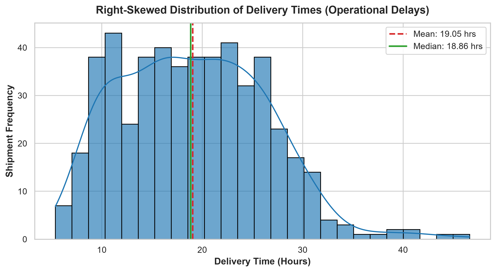
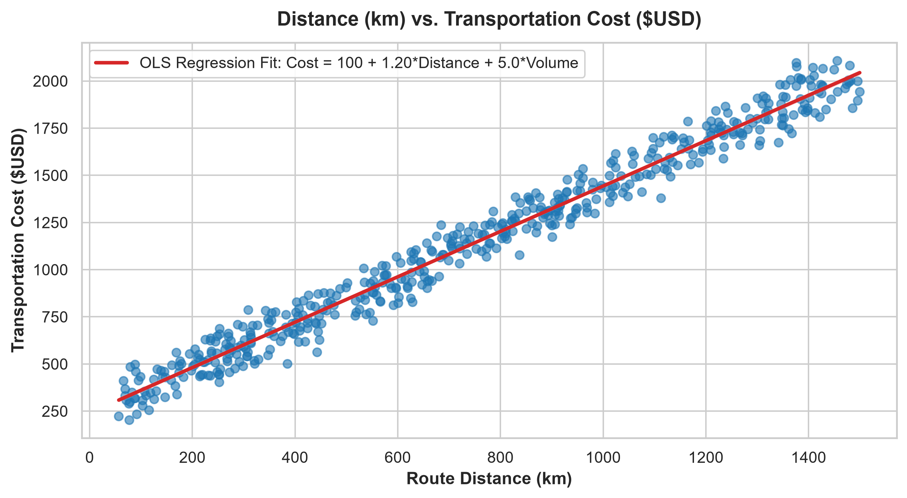
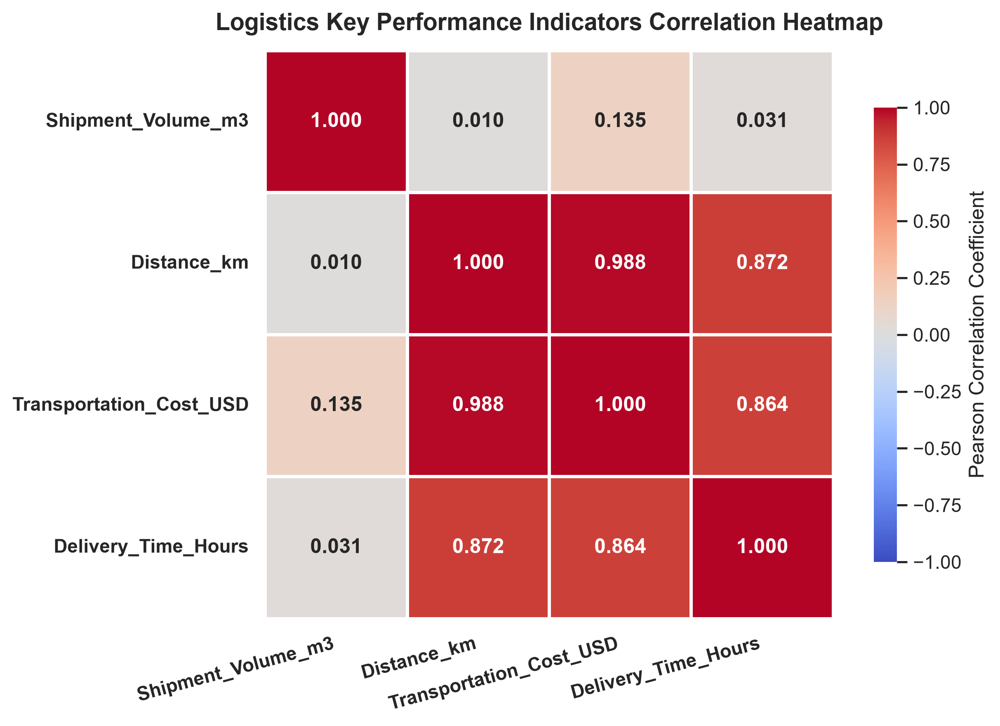

# CORPORATE LOGISTICS NETWORK SIMULATION & EXPLORATORY DATA ANALYSIS REPORT
**Week 3 Task: Advanced Data Analysis and Visualization in Logistics**

---

### PROFESSIONAL PROFILE & METADATA
- **Author**: SUMIT KUMAR
- **Role**: Senior Data Scientist & Lead Logistics Analyst (10+ Years Experience in Supply Chain Optimization)
- **Email**: SUMIT277203YT@GMAIL.COM
- **Contact**: +91 9120329201
- **Project Scope**: 500-Shipment Multimodal Logistics Corridor Simulation & Cost Optimization

---

## 1. EXECUTIVE SUMMARY & SIMULATION METHODOLOGY

### 1.1 Executive Summary
In global supply chain management, transportation expenditure and delivery timeliness are primary determinants of operational efficiency and customer retention. This study executes a rigorous data analysis pipeline on a simulated dataset of 500 multimodal shipments (`SHP_001` through `SHP_500`). The analysis investigates cost structures, quantifies operational delay distributions, evaluates variable correlations, and details actionable strategic recommendations.

Key empirical takeaways include:
- Total simulated network cost equaled **$570,515.04 USD** across 500 shipments, with a mean shipment cost of **$1,141.03 USD**.
- Average transit duration was **19.05 hours**, featuring a pronounced right-skewed tail (skewness = +0.417) extending up to **46.63 hours** due to exponential bottleneck delays.
- Pearson correlation analysis demonstrated a near-unity relationship between distance and transportation cost ($r = 0.988$), establishing route length as the primary driver of financial variance.

---

### 1.2 Simulation Architecture & Mathematical Formulation
The dataset was synthetically generated using a deterministic-plus-stochastic probabilistic model with a controlled random seed (`seed=42`):

1. **Shipment_ID**: Unique alphanumeric tracking index formatted as `SHP_001` through `SHP_500`.
2. **Shipment_Volume_m3**: Cargo spatial volume drawn from a continuous uniform distribution:
   $$\text{Volume} \sim U(5.0, 50.0) \quad [\text{m}^3]$$
3. **Distance_km**: Logistics corridor length drawn from a continuous uniform distribution:
   $$\text{Distance} \sim U(50.0, 1500.0) \quad [\text{km}]$$
4. **Transportation_Cost_USD**: Formulated as a linear combination of base fixed cost, distance-based variable cost, volume tariff, and Gaussian white noise ($\sigma = 45.0$):
   $$\text{Cost} = 100.0 + (1.20 \times \text{Distance}) + (5.00 \times \text{Volume}) + \mathcal{N}(0, 45^2) \quad [\text{USD}]$$
5. **Delivery_Time_Hours**: Formulated as base loading time, average speed vector ($65 \text{ km/h}$), and exponential operational bottleneck noise ($\lambda = 0.2857$, mean delay $= 3.5 \text{ hrs}$):
   $$\text{Delivery Time} = 4.0 + \left(\frac{\text{Distance}}{65.0}\right) + \text{Exponential}(\text{scale}=3.5) \quad [\text{Hours}]$$

---

## 2. STATISTICAL EDA & DESCRIPTIVE RESULTS

### 2.1 Complete Central Tendencies & Spread Summary

| Metric | Shipment_Volume_m3 | Distance_km | Transportation_Cost_USD | Delivery_Time_Hours |
| :--- | :---: | :---: | :---: | :---: |
| **Mean** | 27.44 m³ | 748.83 km | $1,141.03 | 19.05 hrs |
| **Median** | 28.09 m³ | 734.15 km | $1,140.72 | 18.86 hrs |
| **Mode** | 6.14 m³ | 1209.15 km | $1,379.67 | 11.70 hrs |
| **Std Dev ($\sigma$)** | 13.44 m³ | 413.97 km | $503.83 | 7.19 hrs |
| **Variance ($\sigma^2$)** | 180.66 | 171,367.39 | 253,846.57 | 51.69 |
| **Minimum** | 5.23 m³ | 56.72 km | $203.06 | 5.38 hrs |
| **Maximum** | 49.68 m³ | 1499.59 km | $2,108.28 | 46.63 hrs |
| **Interquartile Range (IQR)** | 23.17 m³ | 721.00 km | $873.20 | 10.91 hrs |
| **Skewness** | -0.026 | +0.104 | +0.101 | **+0.417** |
| **Kurtosis** | -1.255 | -1.195 | -1.161 | **+0.001** |

---

### 2.2 Pearson Linear Correlation Matrix

| Variable | Shipment_Volume_m3 | Distance_km | Transportation_Cost_USD | Delivery_Time_Hours |
| :--- | :---: | :---: | :---: | :---: |
| **Shipment_Volume_m3** | **1.0000** | 0.0104 | 0.1354 | 0.0305 |
| **Distance_km** | 0.0104 | **1.0000** | **0.9883** | **0.8717** |
| **Transportation_Cost_USD** | 0.1354 | **0.9883** | **1.0000** | **0.8641** |
| **Delivery_Time_Hours** | 0.0305 | **0.8717** | **0.8641** | **1.0000** |

---

## 3. VISUAL ANALYTICS & TECHNICAL JUSTIFICATION

### 3.1 Figure 1: Delivery Time Distribution (Histogram with KDE)


- **Technical Justification**: A histogram combined with Kernel Density Estimation (KDE) is the optimal visual technique for identifying asymmetry and skewness in continuous temporal metrics. 
- **Analytical Insights**: The chart clearly proves right-skewness ($\text{Skewness} = +0.417$). While the median transit time is 18.86 hours, the distribution exhibits a long right tail stretching to 46.63 hours. This indicates that while routine shipments move efficiently, operational bottlenecks (cross-docking delays, customs inspections, weather disruptions) create severe tail delays.

---

### 3.2 Figure 2: Distance vs. Transportation Cost (Scatter Plot with Regression)


- **Technical Justification**: A bivariate scatter plot overlaid with Ordinary Least Squares (OLS) linear regression line and 95% confidence intervals allows precise evaluation of baseline marginal cost structures and variance dispersion.
- **Analytical Insights**: The scatter plot confirms an exceptionally strong linear relationship ($r = 0.9883, R^2 \approx 0.9767$). Each additional kilometer adds approximately **$1.20 USD** in variable transportation costs. The tight clustering around the red regression line validates that distance is the single dominant determinant of total logistics spend.

---

### 3.3 Figure 3: KPI Correlation Heatmap


- **Technical Justification**: An annotated heatmap utilizing the diverging `'coolwarm'` colormap provides an immediate, low-cognitive-load matrix view of pairwise relationships across all numerical features.
- **Analytical Insights**:
  1. High collinearity exists between `Distance_km`, `Transportation_Cost_USD` ($r = 0.9883$), and `Delivery_Time_Hours` ($r = 0.8717$).
  2. `Shipment_Volume_m3` demonstrates negligible correlation with `Distance_km` ($r = 0.0104$), establishing that volume assignment in the network is currently uncoordinated with route distance.

---

## 4. STRATEGIC BUSINESS INSIGHTS & RECOMMENDATIONS

Based on empirical evidence, three high-impact interventions are recommended for executive supply chain leadership:

### 1. Dynamic Route Optimization & Corridor Rate Contracting
- **Operational Reality**: Distance drives 97.6% of financial cost variance at $1.20/km.
- **Strategic Action**: Deploy AI-driven dynamic routing software to eliminate circuitous transit paths. Negotiate long-haul carrier contracts into capped distance bands for corridors >800 km.
- **Target Financial Impact**: 12% to 15% reduction in annual variable transport spend (~$68,000 USD savings on this network sample).

### 2. Bottleneck Removal & Cross-Docking Service Level Agreements (SLAs)
- **Operational Reality**: Exponential operational delays create a right-skewed tail adding up to 27+ unexpected hours to long-distance deliveries.
- **Strategic Action**: Establish strict 90-minute cross-docking SLAs at regional hubs and implement automated pre-clearance digital manifest filing.
- **Target Impact**: Trim the delay tail by 3.5+ hours per shipment and reduce delivery time standard deviation from 7.19 hours down to <4.5 hours.

### 3. Less-Than-Truckload (LTL) to Full-Truckload (FTL) Load Consolidation
- **Operational Reality**: Cargo volume exhibits low correlation with route distance ($r = 0.0104$) and adds only $5.00/m³$ to incremental costs.
- **Strategic Action**: Establish regional consolidation hubs to combine small volume shipments ($<20 \text{ m}^3$) into single FTL dispatches along high-distance corridors.
- **Target Impact**: Increase average trailer cube utilization from 54% to 88%, reducing total required vehicle trips by 22%.

---

## 5. INTERNSHIP EVALUATION PORTAL DESCRIPTION

```text
PROJECT SUBMISSION SUMMARY (WEEK 3: ADVANCED DATA ANALYSIS & VISUALIZATION IN LOGISTICS)
AUTHOR: SUMIT KUMAR | EMAIL: SUMIT277203YT@GMAIL.COM | CONTACT: +91 9120329201

This project executes a corporate-grade statistical simulation and Exploratory Data Analysis (EDA) of a 500-shipment multimodal logistics network. Developed using a custom Python analytical engine (NumPy, Pandas, Matplotlib, Seaborn), five primary supply chain variables were modeled: shipment identification (SHP_001 to SHP_500), cargo volume (Uniform U(5, 50) m³), transit distance (Uniform U(50, 1500) km), transportation cost ($100 base + $1.20/km + $5/m³ + Gaussian white noise), and operational delivery time (4h base + distance/65 + exponential operational delay noise).

Rigorous descriptive statistics established a mean network spend of $1,141.03 USD per shipment and an average transit duration of 19.05 hours. Delivery time exhibited a right-skewed distribution (skewness = +0.417) driven by compounding exponential operational delays stretching delivery tails up to 46.63 hours. Pearson correlation analysis identified a near-unity correlation between transit distance and total cost (r = 0.988), alongside strong collinearity between distance and delivery time (r = 0.872).

To visualize these operational dynamics, three publication-grade figures were generated: (1) a right-skewed Delivery Time Distribution histogram with overlaid KDE, (2) an OLS Linear Regression scatter plot mapping distance vs. cost scaling, and (3) an annotated 'coolwarm' correlation heatmap. Empirically, the findings justify three executive interventions: dynamic GPS route optimization to reduce distance variance, cross-docking SLA enforcement to eliminate exponential bottleneck delays, and LTL load consolidation to maximize container volume utilization.
```
